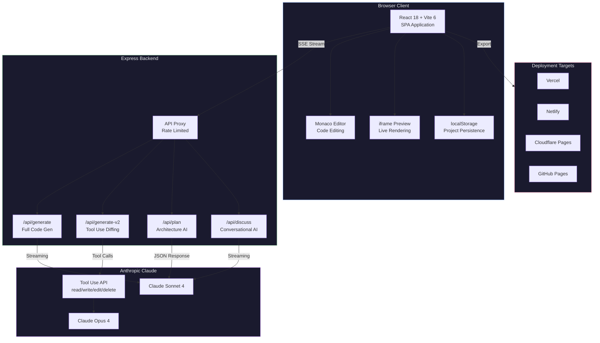
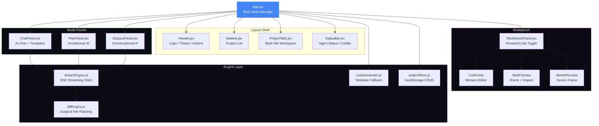
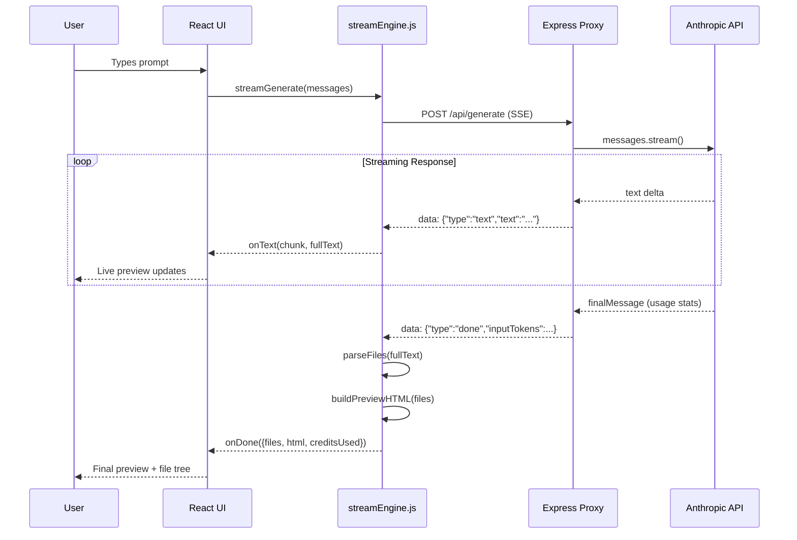
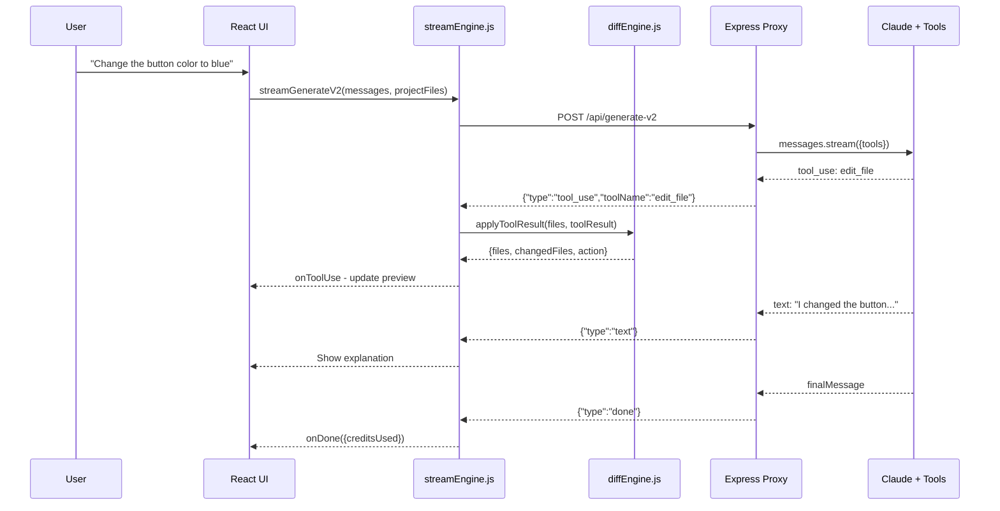
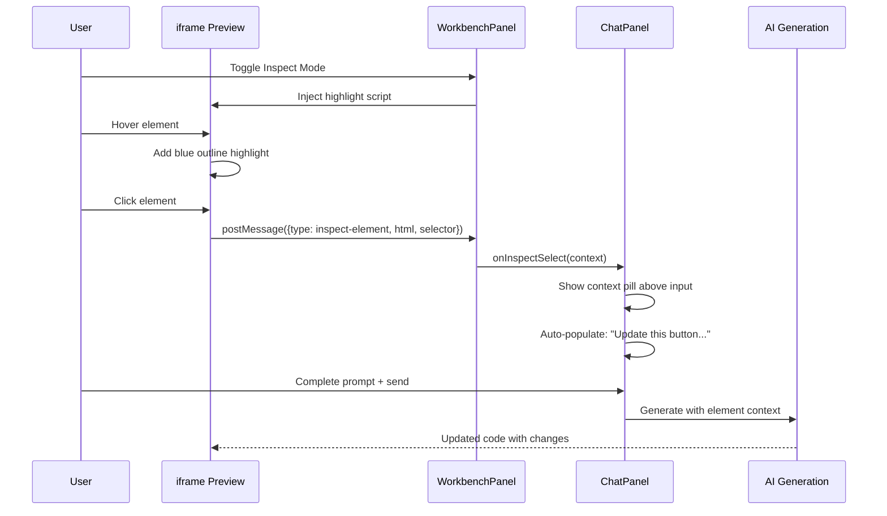

<p align="center">
  
</p>

<h1 align="center">MaterialFlow AI</h1>

<p align="center">
  <strong>Production-grade AI platform for building full-stack web and mobile applications.</strong><br/>
  Prompt, Plan, Build, Deploy — all from your browser.
</p>

<p align="center">
  
  
  
  
  
  
  
  
</p>

---

## Key Features

| Feature | Description |
|---------|-------------|
| **AI Code Generation** | Describe your app, get a full working codebase via Claude, GPT-4o, Gemini, or DeepSeek |
| **Multi-Model Support** | 6 AI models across 4 providers — Anthropic, OpenAI, Google, DeepSeek with per-provider streaming |
| **Tool-Use API (v2)** | Surgical multi-file editing — no full regeneration, just precise diffs |
| **Sandpack Runtime** | Real NPM bundling via @codesandbox/sandpack-react — Tailwind, shadcn/ui, Framer Motion work |
| **Inspect Mode** | v0-style point-and-click element selection for contextual AI editing |
| **Screenshot to Code** | Upload a screenshot or mockup, AI recreates it as a working web app |
| **GitHub Sync** | Push/pull projects to GitHub repos via Git Trees API with PAT auth |
| **Real Deployment** | One-click deploy to Vercel (API v13) and Netlify with live URLs and status polling |
| **Supabase Integration** | Database schema generation, auth hooks, data hooks, RLS policies, SQL migrations |
| **Architecture Planner** | AI-powered component tree, API design, and tech stack analysis |
| **Discussion Mode** | Conversational AI advisor — no code, just strategy and guidance |
| **Version History** | Undo/redo with checkpoint timeline, diff visualization, Ctrl+Z/Y shortcuts |
| **Monaco Editor** | Full VS Code editing experience with syntax highlighting |
| **Live Preview** | Real-time preview with Sandpack (JSX) or iframe (HTML), error capture, "Fix with AI" |
| **Environment Variables** | Secure key/value store for API keys, database URLs, injected into generated projects |
| **Dark and Light Themes** | Premium design system with 40+ CSS tokens and smooth transitions |
| **Multi-Project Tabs** | Tabbed workspace with rename, fork, delete, and ZIP export |
| **Secure by Default** | API keys local-only, backend proxy, rate limiting, input validation |

---

## Production Architecture

### High-Level System Overview



### Frontend Component Architecture



### API Streaming Pipeline



### Tool-Use Flow (v2 — Surgical Editing)



### Inspect Mode Flow (v0-Style Contextual Editing)



---

## Quick Start

### Prerequisites

- **Node.js** >= 18
- **npm** >= 9

### Setup

```bash
# Clone the repository
git clone https://github.com/Ashutosh0x/materialflow-ai.git
cd materialflow-ai

# Install dependencies
npm install

# Copy environment config
cp .env.example .env

# Start development (frontend only)
npm run dev

# Start with backend (for AI streaming)
npm run dev:full
```

The app runs at **http://localhost:5173**
The backend API runs at **http://localhost:3001**

### API Keys

To use AI code generation, add your Anthropic API key in **Settings > API Keys**.
Keys are stored locally in your browser's localStorage — never sent to our servers.

---

## Project Structure

```
materialflow-ai/
├── index.html                  # App entry point with SEO meta tags
├── package.json                # Dependencies and scripts
├── vite.config.js              # Vite config with API proxy and code splitting
├── .env.example                # Environment variable documentation
├── Dockerfile                  # Multi-stage production Docker build
├── docker-compose.yml          # Container orchestration
├── nginx.conf                  # Nginx reverse proxy config
├── vercel.json                 # Vercel deployment config
├── netlify.toml                # Netlify deployment config
├── server/
│   └── index.js                # Express backend — 4 API endpoints + rate limiting
└── src/
    ├── main.jsx                # React root with ErrorBoundary
    ├── App.jsx                 # Main app — state management and orchestration
    ├── components/
    │   ├── Header.jsx          # Top bar — logo, project name, theme, undo/redo, GitHub sync
    │   ├── Sidebar.jsx         # Project list with CRUD operations
    │   ├── ChatPanel.jsx       # AI chat — templates, inspect context, screenshot upload
    │   ├── WorkbenchPanel.jsx  # Preview (Sandpack/iframe) + Monaco editor + inspect mode
    │   ├── SandpackPreview.jsx # Real NPM bundling via @codesandbox/sandpack-react
    │   ├── PlanPanel.jsx       # AI architecture planner (real Claude streaming)
    │   ├── DiscussPanel.jsx    # AI discussion mode (real Claude streaming)
    │   ├── HistoryPanel.jsx    # Version history timeline with undo/redo/diff
    │   ├── SettingsPanel.jsx   # API keys, deploy tokens, GitHub PAT, env vars, theme
    │   ├── ProjectTabs.jsx     # Multi-project tabbed workspace
    │   ├── StatusBar.jsx       # Bottom bar — agent status, credits, model info
    │   ├── DeployModal.jsx     # Real Vercel/Netlify deployment with live URLs
    │   ├── DeployFab.jsx       # Floating deploy button
    │   ├── NewProjectModal.jsx # New project wizard with infra options
    │   ├── ModelSelector.jsx   # AI model picker dropdown
    │   ├── AgentStatus.jsx     # Agent thinking/writing/done indicator
    │   ├── Toast.jsx           # Toast notification system
    │   ├── ErrorBoundary.jsx   # Global error recovery UI
    │   └── ConfirmDialog.jsx   # Custom confirmation dialog
    ├── engine/
    │   ├── streamEngine.js     # SSE streaming — generate, plan, discuss, v2
    │   ├── modelRouter.js      # Multi-provider routing (Anthropic/OpenAI/Gemini/DeepSeek)
    │   ├── githubEngine.js     # GitHub API — create repos, push/pull files, commits
    │   ├── deployEngine.js     # Real Vercel API v13 + Netlify API deployment
    │   ├── supabaseEngine.js   # Supabase project init, schema gen, auth/data hooks
    │   ├── historyEngine.js    # Version checkpoints with undo/redo/timeline/diff
    │   ├── codeGenerator.js    # Template-based fallback code generation
    │   ├── diffEngine.js       # Surgical file patching from tool-use API
    │   └── projectStore.js     # localStorage persistence layer
    └── styles/
        └── index.css           # 4400-line design system (dark/light themes)
```

---

## API Endpoints

The Express backend exposes 4 streaming SSE endpoints:

| Endpoint | Method | Purpose | System Prompt |
|----------|--------|---------|---------------|
| `/api/generate` | POST | Full code generation (v1) | Build-focused — generates file blocks |
| `/api/generate-v2` | POST | Tool-use based editing | Surgical edits via read_file, write_file, edit_file |
| `/api/plan` | POST | Architecture planning | Returns structured JSON (components, APIs, files) |
| `/api/discuss` | POST | Conversational advice | No code — strategy, best practices, requirements |
| `/api/health` | GET | Health check | Returns status, timestamp, version |

### Tool Definitions (v2)

| Tool | Description |
|------|-------------|
| `read_file` | Read a project file's contents |
| `write_file` | Create or overwrite a file |
| `edit_file` | Search-and-replace within a file |
| `delete_file` | Remove a file from the project |
| `list_files` | List all project files |
| `add_dependency` | Add an NPM package to package.json |

---

## Scripts

| Script | Description |
|--------|-------------|
| `npm run dev` | Start Vite dev server (frontend only) |
| `npm run server` | Start Express backend server |
| `npm run dev:full` | Start both frontend and backend concurrently |
| `npm run build` | Production build with code splitting |
| `npm run preview` | Preview production build locally |

---

## Architecture Stack

| Layer | Technology |
|-------|-----------|
| **Frontend** | React 18 + Vite 6, vanilla CSS design system (4200 lines) |
| **Editor** | Monaco Editor (VS Code engine), lazy loaded via React.lazy |
| **Backend** | Express.js proxy — 4 SSE streaming endpoints with rate limiting |
| **AI** | Anthropic Claude (Sonnet 4 / Opus 4) — streaming + tool use |
| **Storage** | localStorage for projects, settings, API keys |
| **Export** | JSZip for multi-file project ZIP export |
| **Icons** | Lucide React + Material Symbols Outlined |
| **CI/CD** | GitHub Actions (lint, type-check, build, security, deploy) |
| **Container** | Docker multi-stage build, Nginx reverse proxy |
| **Deploy** | Vercel, Netlify, Cloudflare Pages, GitHub Pages |

---

## Deployment

### Vercel

```bash
npx vercel --prod
```

### Netlify

```bash
npx netlify deploy --prod --dir=dist
```

### Docker

```bash
# Build and run
docker compose up -d

# With Nginx reverse proxy (production profile)
docker compose --profile production up -d
```

### GitHub Actions

Push to `main` triggers automatic deployment. Required secrets:

| Secret | Purpose |
|--------|---------|
| `NETLIFY_AUTH_TOKEN` | Netlify deploy token |
| `NETLIFY_SITE_ID` | Netlify site identifier |
| `VERCEL_TOKEN` | Vercel deploy token |
| `VERCEL_ORG_ID` | Vercel organization ID |
| `VERCEL_PROJECT_ID` | Vercel project ID |

---

## Security

- **Local API keys** — stored in browser localStorage, never transmitted to our servers
- **Backend proxy** — all Anthropic calls routed through Express proxy to protect keys
- **Rate limiting** — 20 requests/minute per IP on all API endpoints
- **Input validation** — message structure, role, content type validated server-side
- **Client disconnect** — SSE streams abort gracefully on client disconnect
- **CORS** — enabled for development, locked down in production via Nginx
- **Security headers** — CSP, X-Frame-Options, HSTS via Nginx reverse proxy
- **Docker isolation** — non-root user, minimal base image, health checks

---

## Roadmap

- [x] v1 — Full code generation with Claude streaming
- [x] v2 — Tool-use based surgical file editing
- [x] Inspect Mode — v0-style point-and-click contextual editing
- [x] AI Architecture Planner — real Claude streaming
- [x] AI Discussion Mode — conversational advisor
- [x] Sandpack Runtime — real NPM packages in-browser via @codesandbox/sandpack-react
- [x] Multi-Model Support — Anthropic, OpenAI, Google Gemini, DeepSeek streaming
- [x] GitHub Sync — push/pull to repos via Git Trees API
- [x] Real Deployment — Vercel API v13 + Netlify API with live URLs
- [x] Supabase Integration — schema generation, auth hooks, data hooks, migrations
- [x] Screenshot to Code — image upload with vision model support
- [x] Version History — undo/redo checkpoints with timeline and diff
- [x] Environment Variables — secure key/value management in Settings
- [ ] WebContainers — full Node.js runtime in the browser
- [ ] Expo/React Native — mobile app QR-code preview
- [ ] Figma Import — convert Figma designs to React components
- [ ] Autonomous Agent Mode — AI explores, debugs, and iterates independently
- [ ] Collaborative Editing — multi-user real-time sessions

---

## License

[MIT](LICENSE)

---

<p align="center">
  Built by <a href="https://github.com/Ashutosh0x">Ashutosh0x</a>
</p>
